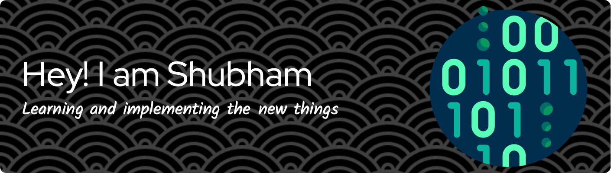

<!-- TOP BANNER -->

  

<!-- TYPING ANIMATION INTRO -->

  

<!-- VISITOR COUNTER & SOCIAL BADGES -->

  
  
  

 

<!-- FIRST CODING GIF -->

  

<!-- SECTION 1: CURRENTLY WORKING ON -->

  
  
  

 

<!-- SECTION 2: LANGUAGES & TOOLS -->

  

 

<!-- INTERACTIVE COLLAPSIBLE BIO -->

  
<b>🔍 Tap to discover more about me!</b>

   
  

    👋 Hi there! I'm <b>Shubham</b>, a developer driven by continuous iteration, clean code, and building software that feels effortless to use.  
    🌱 <b>Currently learning:</b> Advanced Swift concurrency patterns & Machine Learning model deployment. 
    💡 <b>Fun fact:</b> I genuinely enjoy debugging — there's nothing quite like finding that one missing line that makes everything click. 
    🎯 <b>Current Focus:</b> Bridging native iOS experiences with intelligent backend systems.
  

 

<!-- SECTION 3: GITHUB STATS & TROPHIES -->

  
  

  

<!-- CONTRIBUTION SNAKE ANIMATION -->

  

 

<!-- SECTION 4: CONNECT WITH ME -->

 

<!-- SECOND CODING GIF -->

  

  <i>I'm always open to discussing native iOS development, ML workflows, or full-stack architectures.  
  Got an idea or a project in mind? Reach out and let's ship something great together!</i>

